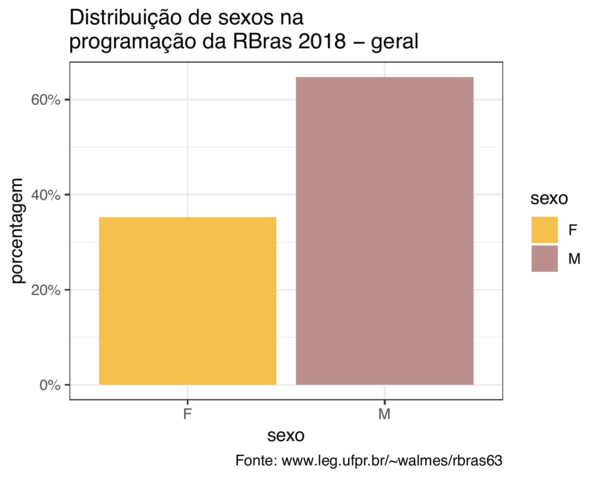

Este repositório contém o código para a extração de
dados relativos à distribuição de sexos dos participante em eventos
recentes de Estatística na Brasil. Os 3 eventos considerados saão: 

1. XVI EMR - https://elo.iweventos.com.br/evento/escoladeregressao2019/home

2. Sinape 2018 -  http://www.sinape2018.com.br/

3. RBras 2018 - http://rbras.org.br/

